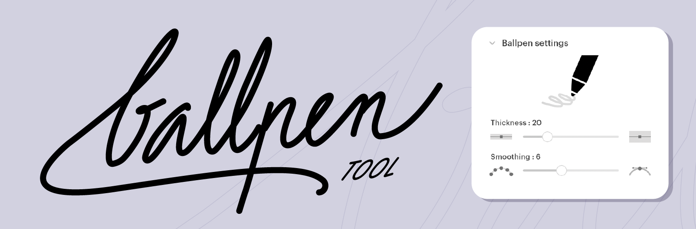

# 🖊️ BallpenTool (EN)

This is a plugin for the [Glyphs font editor](http://glyphsapp.com/) by Georg Seifert.  
It adds a custom Ballpen (ballpoint pen) Tool to Glyphs, providing a smooth, consistent stroke with a fixed width and rounded stroke endings.
The Ballpen Tool is ideal for clean sketching, monoline-lettering work, and designing typefaces with uniform stroke widths.
You can adjust both thickness and smoothing directly from the companion palette.
After installation, it will appear in the toolbar with a ballpen icon.

### Installation

1. Download the complete ZIP file and unpack it, or clone the repository.
2. Double click the `.glyphsPlugin` file. Confirm the dialog that appears in Glyphs.
3. Restart Glyphs.

### Usage Instructions

1. Open a glyph in Edit View.
2. Select the Ballpen Tool from the toolbar.
3. Click and drag in the editor to draw paths freely.

The tool generates monoline strokes with rounded ends, following your movements for quick sketching and clean outlines.

### Ballpen Tool Palette

The Ballpen Tool includes a palette to fine-tune your line style:

- **Thickness**: Adjust the fixed stroke width.
- **Smoothing**: Control how the curves are interpreted.

Higher values smooth your shapes; lower values let you retain more gesture and detail.

With these controls, you can tailor the drawing experience to match your workflow, whether you're drafting ideas or finalizing glyph shapes.

### Requirements

The plugin requires Glyphs 3.2 or higher.
It may not work properly in earlier versions.

### License

Copyright 2026 Jean-Baptiste Dunesme

Licensed under the Apache License, Version 2.0 (the "License");
you may not use this file except in compliance with the License.
You may obtain a copy of the License at

http://www.apache.org/licenses/LICENSE-2.0

See the **LICENSE** file included in this repository for further details.

---

# 🖊️ BallpenTool (FR)

BallpenTool est une extension pour l’éditeur de polices [Glyphs](http://glyphsapp.com/) développé par Georg Seifert.
Elle ajoute à Glyphs un outil Stylo bille personnalisé, offrant un trait régulier à largeur fixe, avec des terminaisons arrondies.
Le Ballpen est idéal pour le croquis propre, le lettrage monolinéaire et la création de glyphes avec une épaisseur uniforme.
Vous pouvez ajuster l’épaisseur et le lissage du tracé depuis la palette dédiée.
Une fois installé, l’outil apparaît dans la barre d’outils avec une icône de stylo bille.

### Installation

1. Téléchargez le fichier ZIP complet et décompressez-le, ou clonez le dépôt.
2. Double-cliquez sur le fichier `.glyphsPlugin`. Confirmez le message qui s’affiche dans Glyphs.
3. Redémarrez Glyphs.

### Instructions d’utilisation

1. Ouvrez un glyphe dans la vue Édition.
2. Sélectionnez l’outil Stylo bille dans la barre d’outils.
3. Cliquez et faites glisser dans la fenêtre d’édition pour dessiner librement des contours.

L’outil crée des tracés monolinéaires à extrémités arrondies, adaptés à un dessin fluide et propre directement sur le glyphe.

### Palette de l’outil Stylo bille

Le BallpenTool est accompagné d’une palette pour ajuster précisément vos traits :

- **Épaisseur** : contrôle la largeur du trait, fixe et uniforme.
- **Lissage** : contrôle la fluidité du tracé.

Des valeurs plus élevées donnent des courbes plus douces et épurées ; des valeurs plus basses suivent davantage vos gestes.
Ces réglages permettent d’adapter l’outil à votre style, que ce soit pour un dessin rapide ou une mise au propre soignée.

### Configuration requise

Le plugin nécessite Glyphs 3.2 ou une version ultérieure.
Il se peut qu’il ne fonctionne pas correctement avec les versions antérieures.

### Licence

Copyright 2026 Jean-Baptiste Dunesme

Distribué sous licence Apache License, Version 2.0 (la “Licence”).
Vous ne pouvez pas utiliser ce fichier sans respecter les conditions de la Licence.
Vous pouvez consulter une copie de la Licence à l’adresse suivante :

http://www.apache.org/licenses/LICENSE-2.0

Reportez-vous au fichier **LICENSE** inclus dans ce dépôt pour plus de détails.

